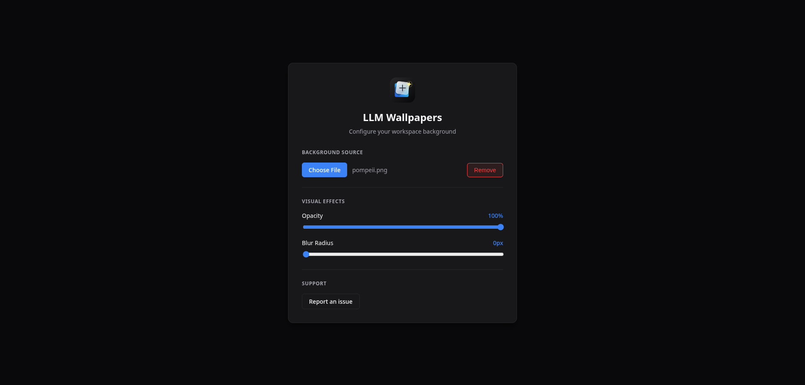
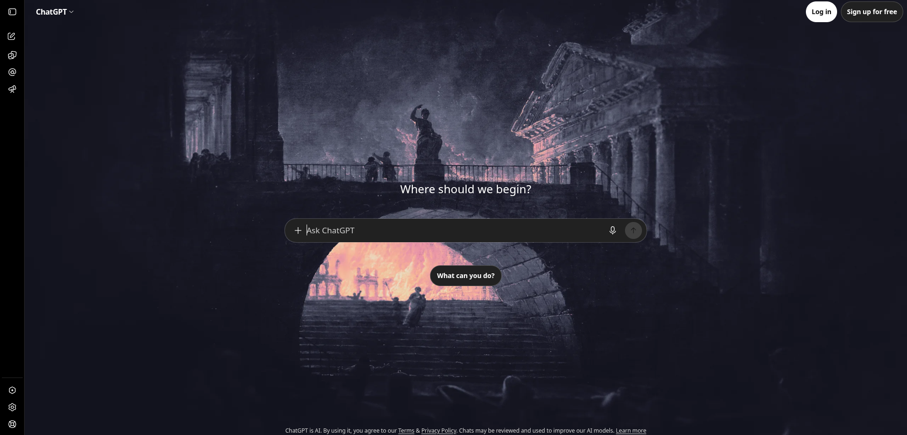
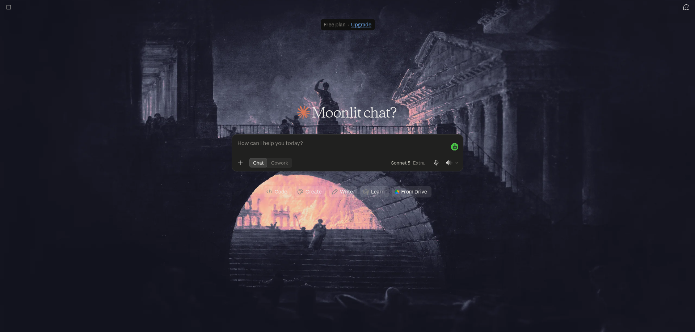
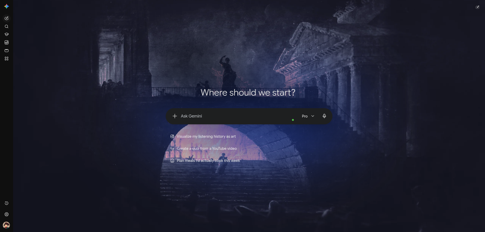

<p align="center">
  
</p>

<h1 align="center">LLM Wallpapers</h1>

<div align="center">
  <a href="#readme"><strong>README</strong></a>
  <span> · </span>
  <a href="#install">Install</a>
  <span> · </span>
  <a href="#privacy">Privacy</a>
  <span> · </span>
  <a href="#license">MIT license</a>
</div>

---

A refined Chrome extension for making AI chat windows feel more like your workspace and less like a blank browser tab.

Use it to put your own image behind [ChatGPT](https://chatgpt.com/), [Claude](https://claude.ai/), and [Gemini](https://gemini.google.com/), then soften it with blur and opacity so the conversation stays readable.

[Report an issue](https://github.com/s-arbu/llm-wallpapers-extension/issues/new) | [View roadmap and issues](https://github.com/s-arbu/llm-wallpapers-extension/issues)

## Works with

- ChatGPT
- Claude
- Gemini
- more coming soon...

## Why this exists

Most AI chat UIs are clean, but they can also feel cold and generic. LLM Wallpapers lets you keep the clean layout while adding a background that feels more like your own setup.

It is useful when you want:

- a personal wallpaper behind your chats
- more contrast control without making the interface feel heavy
- a simple browser-local setup with no account or backend
- a background that stays in place while the conversation remains the focus

## Screenshots









## Install

### From a release

1. Open the latest beta release on GitHub.
2. Download the zip file for the extension.
3. Extract it.
4. Open `chrome://extensions` in Chrome.
5. Turn on Developer mode.
6. Select Load unpacked and choose the extracted folder.
7. Open [Gemini](https://gemini.google.com/), [ChatGPT](https://chatgpt.com/), or [Claude](https://claude.ai/), then open LLM Wallpapers from the toolbar.

### From source

1. Clone or download this repo.
2. Install dependencies with Bun.
3. Build the extension.
4. Load the `dist/` folder in Chrome as an unpacked extension.
5. Open your AI chat page and use the extension.

```bash
bun install
bun run build
```

### Requirements

- A Chromium-based browser
- Developer mode enabled
- [Bun](https://bun.sh/) 1.4 or newer

## Privacy

Your selected image and settings stay in the browser. There is no login, no server, and no cloud sync in the current setup.

---
---

## Quick notes for maintainers

This section is mainly for devs working on the project.

### Current settings shape

The extension stores wallpaper settings in browser local storage under one object: `llm_wallpaper_settings`.

- `imageDataUrl`: selected image as a data URL, or `null`
- `fileName`: selected image filename, or `null`
- `opacity`: number between `0.05` and `1`
- `blur`: blur amount in pixels
- `version`: schema version, currently `1`

The schema is intentionally kept stable so older settings can be migrated forward instead of being reset when fields change.

### Release checklist

Before shipping:

- [package.json](package.json): version matches the release tag
- [public/manifest.json](public/manifest.json): extension version matches the bundle you ship
- [README.md](README.md): install steps point to the GitHub release asset
- [.github/workflows/release-beta.yml](.github/workflows/release-beta.yml): release workflow uploads the zip asset
- [.github/ISSUE_TEMPLATE/provider-bug.md](.github/ISSUE_TEMPLATE/provider-bug.md): bug reports include provider, version, route, and screenshot
- [docs/beta-browser-matrix.md](docs/beta-browser-matrix.md): browser coverage and provider caveats are listed

## Roadmap

- [x] Gemini support
- [x] ChatGPT support
- [x] Claude support
- [x] local image compression and saved settings
- [x] provider adapter boundary
- [x] automated provider matching and DOM checks
- [x] beta readiness: provider smoke checks and release checklist
- [ ] pre-release: Chrome Web Store packaging, privacy review, and rollback plan
- [ ] V2: bundled wallpaper presets
- [ ] V2: user-uploaded wallpapers alongside presets

See [ROADMAP.md](ROADMAP.md) for the broader plan and the authenticated test-state notes.

## Help and feedback

Found a bug or want to suggest a change? [Open an issue](https://github.com/s-arbu/llm-wallpapers-extension/issues/new) with the provider, browser version, and steps to reproduce. If a screenshot helps, include it.

You can also [browse existing issues](https://github.com/s-arbu/llm-wallpapers-extension/issues) before opening a new one.

## Contributing

Contributions are welcome. This is still a small early-stage project, so please open an issue first for larger changes before you start.

<details>
<summary>Contribution guidelines</summary>

1. Fork the repo and create a new branch from the default branch.
2. Use a short, descriptive branch name such as `fix/gemini-overlay` or `feature/chatgpt-adapter`.
3. Keep each change focused on one thing.
4. Run `bun run build` before opening a pull request.
5. Explain what changed, how it was tested, and link the related issue.
6. Open the pull request against the default branch and respond to review feedback in the same branch.

</details>

## License

This project is licensed under the [MIT License](LICENSE).
